# GreenRoot Mobile — Architecture Audit: Riverpod, Dio, Repository Pattern

**Audit date:** 2026-07-10
**Codebase:** `/Users/meharbandaru/Documents/GitHub/greenroot-mobile`
**Flutter SDK:** >=3.22.0 | **Dart SDK:** >=3.4.0

---

## Required Summary Block

```
Is Riverpod currently used?          Yes — Well Implemented (StateNotifier pattern throughout)
Is Dio currently used?               Yes — Mostly Centralized (ApiClient singleton + AuthInterceptor)
Is Repository Pattern currently used? Yes — Partially (12 feature repositories, 3 bypass patterns)

Should GreenRoot change now?         Partially — targeted cleanup, not a full refactor
Recommended approach:                Option B (Small cleanup only) — fix 6 identified bypasses
Estimated V1 impact:                 Low
Estimated code change:               approximately 8–12% of lib/ files affected
Estimated migration effort:          3–5 engineer-days before V1
```

---

## Phase 1 — Dependency Inventory

### pubspec.yaml Packages

| Package | Version | In pubspec | Used in lib/ | Notes |
|---|---|---|---|---|
| `dio` | ^5.4.3+1 | Yes | Yes | Core HTTP client |
| `flutter_riverpod` | ^2.5.1 | Yes | Yes | State management |
| `riverpod_annotation` | ^2.3.4 | Yes | No | Listed but code-gen not used — `@riverpod` annotations absent |
| `freezed_annotation` | ^2.4.4 | Yes | No | Listed but Freezed models not used — all models are hand-written |
| `json_annotation` | ^4.9.0 | Yes | No | Listed but no `@JsonSerializable` annotations found |
| `equatable` | ^2.0.5 | Yes | No | Listed but no `Equatable` subclasses found |
| `flutter_secure_storage` | ^9.2.2 | Yes | Yes | `SecureStorageService` |
| `go_router` | ^14.6.1 | Yes | Yes | `router.dart` |
| `rxdart` | ^0.27.7 | Yes | No | In pubspec, no `rxdart` import found |
| `logger` | ^2.4.0 | Yes | Yes | `AppLogger` |
| `intl` | ^0.19.0 | Yes | Yes | Date/currency formatting |
| `flutter_map` | ^7.0.2 | Yes | Yes | Map screens |
| `latlong2` | ^0.9.0 | Yes | Yes | Coordinates |
| `geolocator` | ^13.0.2 | Yes | Yes | GPS tracking |
| `mobile_scanner` | ^5.2.3 | Yes | Yes | QR scanner |
| `image_picker` | ^1.1.2 | Yes | Yes | Avatar / ad photos |
| `image` | ^4.2.0 | Yes | Yes | Photo watermarking |
| `qr_flutter` | ^4.1.0 | Yes | Yes | QR code display |
| `url_launcher` | ^6.3.0 | Yes | Yes | External URLs |
| `cached_network_image` | ^3.3.1 | Yes | Yes | Network images |
| `flutter_svg` | ^2.0.10+1 | Yes | Yes | SVG assets |
| `pdf` | ^3.11.1 | Yes | Yes | Quotation PDF export |
| `path_provider` | ^2.1.4 | Yes | Yes | PDF file path |
| `share_plus` | ^10.0.0 | Yes | Yes | Share PDF / QR |

**Dev packages:** `build_runner`, `freezed`, `json_serializable`, `riverpod_generator`, `riverpod_lint`, `custom_lint`, `flutter_lints`

**Key finding:** `riverpod_annotation`, `riverpod_generator`, `freezed`, `freezed_annotation`, `json_serializable`, `json_annotation`, `equatable`, and `rxdart` are all declared but **not actually used**. The team has scaffolded for code-generation (Freezed + Riverpod generator) but has not adopted it — all code uses the plain API.

---

## Phase 2 — Riverpod Usage Audit

### Entry Point

`lib/main.dart` wraps `GreenRootApp` in `ProviderScope` correctly. `ApiClient.init()` is called before `runApp`, establishing the singleton before any provider is accessed.

### Auth / Session State

`lib/features/auth/presentation/providers/session_provider.dart` — the entire session lifecycle is managed through Riverpod:
- `sessionProvider` (`StateNotifierProvider<SessionNotifier, SessionState>`) — holds user, roles, workspaces, activeRole, nurseryId
- `permissionServiceProvider` (`Provider<PermissionService>`) — derived from session
- `activeRoleProvider` (`StateNotifierProvider<RoleSelectionNotifier, AppRole?>`)

`lib/features/auth/presentation/providers/auth_provider.dart`:
- `authRepositoryProvider` — `Provider<AuthRepository>` wiring the datasource
- `otpSendProvider`, `otpVerifyProvider` — `StateNotifierProvider` for OTP flows

### Provider Pattern Inventory

| Provider type | Count | Files |
|---|---|---|
| `StateNotifierProvider` | 30+ | orders, dispatches, nurseries, plants, inventory, requests, quotations, vehicles, sourcing, notifications, market, auth, drivers |
| `FutureProvider` / `FutureProvider.family` | 15+ | detail screens, dashboard, tracking, subscriptions |
| `FutureProvider.autoDispose` | 8 | subscriptions, market, buyer connections |
| `StateProvider` / `StateProvider.family` | 4 | tab index, market saved state |
| `Provider` (plain) | 15+ | repositories, permission service, geocoding |
| `StateNotifierProvider.family` | 4 | sourcing by post type, market notifiers |

### ConsumerWidget Adoption

151 `ConsumerWidget` / `ConsumerStatefulWidget` usages found. Only 13 plain `StatefulWidget` instances remain — most are layout-only widgets with no state. No API calls were found in `build()` methods.

### ref.watch / ref.read Usage

`ref.watch` is used correctly for derived display state. `ref.read` is used correctly for notifier method calls (e.g., `ref.read(orderListProvider.notifier).load()`). No `ref.watch` inside callbacks or `initState` was found — patterns are correct.

### Riverpod Maturity Classification

**Well Implemented**

The session, auth, and all feature modules follow `StateNotifierProvider → Repository → ApiClient` consistently. The `PagedNotifier` base class (`lib/core/providers/paged_notifier.dart`) is an additional sophistication that eliminates pagination boilerplate, though it is defined but not yet adopted by all notifiers (most use inline `StateNotifier` with the same pattern).

---

## Phase 3 — Dio Usage Audit

### ApiClient Singleton

`lib/core/network/api_client.dart` — a static singleton `ApiClient.instance` is initialized once in `main.dart` via `ApiClient.init()`. It wraps a single `Dio` instance configured with:
- `baseUrl` from `AppConfig.apiBaseUrl` (environment-aware)
- `connectTimeout: 10s`, `receiveTimeout: 30s`, `sendTimeout: 15s`
- Default headers: `Content-Type: application/json`, `Accept: application/json`
- Two interceptors: `AuthInterceptor` (always) + `_LoggingInterceptor` (dev/qa)

### Auth Interceptor

`lib/core/network/auth_interceptor.dart` — centralized JWT handling:
- `onRequest`: reads `SecureStorageService.getAccessToken()` and injects `Authorization: Bearer <token>`
- `onError` with 401: attempts refresh using a separate bare `Dio` (to avoid interceptor loop), retries original request, clears session on failure
- Auth endpoints (`/auth/*`) are excluded from refresh loop

### Additional Dio Instances (Architecture Smells)

| Location | Instance | Purpose |
|---|---|---|
| `lib/core/network/auth_interceptor.dart:47` | `Dio(BaseOptions(...))` | Token refresh — intentional, avoids interceptor loop |
| `lib/core/services/geocoding/nominatim_service.dart:24` | `Dio(BaseOptions(...))` | Nominatim (OpenStreetMap) — external API, no auth needed |
| `lib/features/market/local_market_providers.dart:166` | `final _rawDio = Dio()` | S3 presigned URL upload — intentional (no auth header wanted) |
| `lib/features/drivers/driver_trip_map_screen.dart:315` | `Dio().get(...)` | OSRM route API — external, no auth needed |
| `lib/features/buyer/buyer_delivery_tracking_screen.dart:237,274` | `Dio().get(...)` | OSRM route API — duplicate of above, no auth needed |

The refresh `Dio` and the three geocoding/routing `Dio` instances are legitimate. The buyer tracking screen duplicates the OSRM pattern already in `driver_trip_map_screen.dart`.

### Dio Centralization Assessment

All calls to the **GreenRoot API** flow through `ApiClient.instance`. The non-centralized `Dio()` instances are exclusively for **external** APIs (OSRM, Nominatim, S3). This is architecturally correct behavior.

### Dio Maturity Classification

**Mostly Centralized**

The one gap: `lib/features/market/local_market_providers.dart` calls `ApiClient.instance.get/post/patch` directly inside `StateNotifier` bodies and `FutureProvider` lambdas without a wrapping repository class (see Phase 4).

---

## Phase 4 — Repository Pattern Audit

### Repository Classes Found

| Repository | Location | Has Provider | Via Riverpod |
|---|---|---|---|
| `AuthRepository` | `features/auth/data/repositories/auth_repository.dart` | `authRepositoryProvider` | Yes |
| `AuthRemoteDataSource` | `features/auth/data/datasources/auth_remote_datasource.dart` | (via repo) | Yes |
| `SubscriptionRemoteDataSource` | `features/subscriptions/subscription_datasource.dart` | `_dataSourceProvider` | Yes |
| `OrderRepository` | `features/orders/orders.dart` | `orderRepositoryProvider` | Yes |
| `DispatchRepository` | `features/dispatches/dispatches.dart` | `dispatchRepositoryProvider` | Yes |
| `TrackingRepository` | `features/tracking/tracking.dart` | `trackingRepositoryProvider` | Yes |
| `QuotationRepository` | `features/quotations/quotations.dart` | `quotationRepositoryProvider` | Yes |
| `NurseryRepository` | `features/nurseries/nurseries.dart` | `nurseryRepositoryProvider` | Yes |
| `PlantRepository` | `features/plants/plants.dart` | `plantRepositoryProvider` | Yes |
| `InventoryRepository` | `features/inventory/inventory.dart` | `inventoryRepositoryProvider` | Yes |
| `RequestRepository` | `features/plant_requests/requests.dart` | `requestRepositoryProvider` | Yes |
| `VehicleRepository` | `features/vehicles/vehicles.dart` | `vehicleRepositoryProvider` | Yes |
| `SourcingRepository` | `features/sourcing/sourcing.dart` | `sourcingRepositoryProvider` | Yes |
| `NotificationRepository` | `features/notifications/notifications.dart` | `notificationRepositoryProvider` | Yes |
| `OwnerDashboardRepository` | `features/dashboard/owner/owner_dashboard_data.dart` | `ownerDashboardRepositoryProvider` | Yes |
| `UserAddressRepository` | `features/profile/my_addresses_screen.dart` | inline Provider | Yes |
| `PaymentRepository` | `features/buyer/buyer_payments_screen.dart` | inline Provider | Yes |

### Repository Bypasses (Direct ApiClient calls NOT through a repository)

| Location | Pattern | Severity |
|---|---|---|
| `features/auth/presentation/screens/create_profile_screen.dart:74` | `AuthRepository(AuthRemoteDataSource(ApiClient.instance))` constructed inline in widget | Medium |
| `features/auth/presentation/screens/nursery_registration_screen.dart:54` | `ApiClient.instance.post(...)` called directly in a `StateNotifier` embedded in the same file | Medium |
| `features/auth/presentation/screens/edit_profile_screen.dart:118` | Same inline `AuthRepository` construction | Medium |
| `features/connections/connections_screen.dart:56` | `ApiClient.instance.post('/api/v1/invites', ...)` directly in a widget method | High |
| `features/buyer/buyer_nursery_connections_screen.dart:70,116` | `ApiClient.instance.get('/api/v1/me/connections')` in a `FutureProvider` lambda | Medium |
| `features/market/local_market_providers.dart` (multiple) | All market providers call `ApiClient.instance` directly — no `MarketRepository` class | High |
| `features/manager/top_items_screen.dart:74,96,119` | `ApiClient.instance.get/post` in notifier embedded in screen file | Medium |
| `features/quotations/quotation_detail_screen.dart:28,1569` | `ApiClient.instance.get` called in async functions at file scope and in the state class | Medium |
| `features/drivers/driver_trip_map_screen.dart:276` | `ApiClient.instance.get` in a `StatefulWidget` method | Medium |
| `features/buyer/buyer_delivery_tracking_screen.dart:183` | `ApiClient.instance.get` in a `StatefulWidget` method | Medium |

### Repository Pattern Classification

**Partial**

12 out of ~18 feature domains have proper repository classes wired through Riverpod providers. The market module, connections, and several one-off screens bypass the pattern. Auth repository construction is duplicated in 2 screens.

---

## Phase 5 — Current Architecture Map

### Mermaid Flowchart (ACTUAL Implementation)

```mermaid
flowchart TD
    subgraph EntryPoint
        main["main.dart\nApiClient.init()\nProviderScope"]
    end

    subgraph CoreNetwork
        AC["ApiClient.instance\n(Dio singleton)"]
        AI["AuthInterceptor\n(JWT inject + 401 refresh)"]
        LI["_LoggingInterceptor\n(dev/qa only)"]
        SS["SecureStorageService\n(flutter_secure_storage)"]
        AC --> AI
        AC --> LI
        AI --> SS
    end

    subgraph AuthLayer
        AR["AuthRepository"]
        ADS["AuthRemoteDataSource"]
        SP["sessionProvider\n(StateNotifier)"]
        PP["permissionServiceProvider"]
        AR --> ADS --> AC
        SP --> AR
        PP --> SP
    end

    subgraph FeatureRepositories["Feature Repositories (12 modules)"]
        OR["OrderRepository"]
        DR["DispatchRepository"]
        TR["TrackingRepository"]
        QR["QuotationRepository"]
        NR["NurseryRepository"]
        PR["PlantRepository"]
        IR["InventoryRepository"]
        RR["RequestRepository"]
        VR["VehicleRepository"]
        SR["SourcingRepository"]
        NTR["NotificationRepository"]
        ODB["OwnerDashboardRepository"]
        OR & DR & TR & QR & NR & PR & IR & RR & VR & SR & NTR & ODB --> AC
    end

    subgraph Providers["Riverpod Providers (StateNotifier / FutureProvider)"]
        OLP["orderListProvider"]
        DLP["dispatchListProvider"]
        QLP["quotationListProvider"]
        NLP["nurseryListProvider"]
        OLP --> OR
        DLP --> DR
        QLP --> QR
        NLP --> NR
    end

    subgraph Screens["Screens (ConsumerWidget / ConsumerStatefulWidget)"]
        OLS["OrderListScreen"]
        DLS["DispatchListScreen"]
        OLS --> OLP
        DLS --> DLP
    end

    subgraph Bypasses["Direct Bypasses (Architecture Gaps)"]
        CS["ConnectionsScreen\n→ ApiClient.instance direct"]
        MKT["local_market_providers.dart\n→ ApiClient.instance direct (no repo)"]
        TS["top_items_screen.dart\n→ ApiClient.instance direct"]
        CPS["create_profile_screen.dart\n→ inline AuthRepository construction"]
        NRS["nursery_registration_screen.dart\n→ ApiClient.instance direct"]
        BNC["buyer_nursery_connections_screen.dart\n→ ApiClient.instance in FutureProvider"]
        CS & MKT & TS & CPS & NRS & BNC --> AC
    end

    main --> AC
    main --> SP
    Screens --> Providers
    Providers --> FeatureRepositories
```



### Architecture Concern Table

| Concern | Current State | Assessment |
|---|---|---|
| State management | Riverpod `StateNotifierProvider` + `FutureProvider` | Well Implemented |
| API client | Single `ApiClient` Dio singleton with interceptors | Well Implemented |
| Auth state | `sessionProvider` with bootstrap + role/workspace resolution | Well Implemented |
| Dependency injection | Manual `Provider<Repository>` wiring via `ApiClient.instance` | Partial — no injectable/get_it |
| Repository layer | 12 clean repositories, 3–4 modules bypassing | Partial |
| Error handling | `sealed class AppError` + `NetworkExceptions.fromDioException` | Well Implemented |
| Loading handling | Consistent `PagedState.isLoading / isLoadingMore / error` | Well Implemented |
| Model mapping | Manual hand-written `fromJson` factory constructors | Consistent but verbose |
| Caching | None — every navigation triggers a fresh API call | Not Implemented |
| Testing support | 2 test files (logic tests only), no widget tests, no repository mocking | Minimal |

---

## Phase 6 — Module-by-Module Audit

| Module | Riverpod | Repository | Dio Centralized | Direct API in UI | Testability | Recommendation |
|---|---|---|---|---|---|---|
| Auth / Session | Yes | Yes (2-layer: DataSource + Repository) | Yes | Partial (2 screens inline-construct repo) | Medium | Fix 2 screen bypasses |
| Users / Profile | Yes (session update) | Partial (edit_profile_screen.dart inline) | Partial | Yes (edit_profile builds repo inline) | Low | Move profile update to authRepositoryProvider |
| Nurseries | Yes | Yes (`NurseryRepository`) | Yes | No | Good | None |
| Orders | Yes | Yes (`OrderRepository`) | Yes | No | Good | None |
| Quotations | Yes | Yes (`QuotationRepository`) | Partial | Yes (address fetch in `quotation_detail_screen.dart`) | Medium | Extract address fetch to NurseryRepository |
| Dispatches | Yes | Yes (`DispatchRepository`) | Yes | No | Good | None |
| Drivers / Trips | Yes | Partial (driver_trip_map fetches nursery inline) | Partial | Yes | Low | Extract nursery fetch to NurseryRepository |
| Tracking | Yes | Yes (`TrackingRepository`) | Yes | No | Good | None |
| Plant Requests | Yes | Yes (`RequestRepository`) | Yes | No | Good | None |
| Inventory | Yes | Yes (`InventoryRepository`) | Yes | No | Good | None |
| Subscriptions | Yes | Partial (datasource, no full repository) | Yes | Partial (payment screen builds datasource inline) | Medium | Add SubscriptionRepository wrapper |
| Plants | Yes | Yes (`PlantRepository`) | Yes | No | Good | None |
| Notifications | Yes | Yes (`NotificationRepository`) | Yes | No | Good | None |
| Local Market | Yes (providers) | No — missing MarketRepository | Direct | Yes (all providers use ApiClient.instance) | Low | Add MarketRepository |
| Sourcing | Yes | Yes (`SourcingRepository`) | Yes | No | Good | None |
| Vehicles | Yes | Yes (`VehicleRepository`) | Yes | No | Good | None |
| Connections | Partial | No repository | Direct | Yes (`connections_screen.dart` calls API directly) | Low | Add InviteRepository |
| Owner Dashboard | Yes | Yes (`OwnerDashboardRepository`) | Yes | No | Good | None |
| Buyer Connections | Partial | No repository | Direct | Yes (`buyer_nursery_connections_screen.dart`) | Low | Move to OrderRepository or new BuyerRepository |
| Top Items | Partial | No repository | Direct | Yes (`top_items_screen.dart` embeds notifier with direct calls) | Low | Add TopItemsRepository |

---

## Phase 7 — Architecture Smells

### Critical

None found. No Dio calls in `build()` methods.

### High

| Smell | Location | Description |
|---|---|---|
| **No `MarketRepository`** | `features/market/local_market_providers.dart` | 20+ `ApiClient.instance` calls scattered across 15 `StateNotifier` / `FutureProvider` bodies. No repository class exists. Untestable, no injection seam. |
| **Direct API in `ConnectionsScreen`** | `features/connections/connections_screen.dart:56` | Invite POST called directly in a widget method with no notifier or repository. Business logic mixed into UI. |

### Medium

| Smell | Location | Description |
|---|---|---|
| **Inline AuthRepository construction** | `create_profile_screen.dart:74`, `edit_profile_screen.dart:118` | `AuthRepository(AuthRemoteDataSource(ApiClient.instance))` constructed inside screen methods instead of using `authRepositoryProvider` |
| **Nursery registration bypasses auth repo** | `nursery_registration_screen.dart:54` | `ApiClient.instance.post('/api/v1/nurseries', ...)` in a `StateNotifier` embedded in a screen file instead of using a proper provider |
| **Quotation detail side-fetches** | `quotation_detail_screen.dart:28,1569` | Nursery address and manager lists fetched via `ApiClient.instance.get` in free functions and state class methods |
| **Driver map screen side-fetch** | `driver_trip_map_screen.dart:276` | Nursery data fetched inline using `ApiClient.instance.get` in `StatefulWidget._fetchNurseryAndGeocode()` |
| **Buyer delivery tracking side-fetch** | `buyer_delivery_tracking_screen.dart:183` | Exact same nursery fetch pattern as `driver_trip_map_screen.dart` — duplicate code |
| **Top items screen embeds notifier** | `manager/top_items_screen.dart:74,96,119` | A `StateNotifier` is defined inside the screen file and calls `ApiClient.instance` directly without a repository |
| **Buyer nursery connections in FutureProvider** | `buyer_nursery_connections_screen.dart:70,116` | `ApiClient.instance` called inside a `FutureProvider.autoDispose` lambda (no repository, no injectable seam) |
| **Subscription payment screen builds datasource** | `subscription_payment_screen.dart:63` | `SubscriptionRemoteDataSource(ApiClient.instance)` constructed inline rather than using the `_dataSourceProvider` already defined in `subscription_provider.dart` |
| **Subscription screen also constructs datasource** | `subscription_screen.dart:985` | Same issue as above in a different location |
| **OSRM fetch duplicated** | `driver_trip_map_screen.dart:315` and `buyer_delivery_tracking_screen.dart:237,274` | OSRM route fetch code duplicated across two screens with identical patterns |

### Low

| Smell | Location | Description |
|---|---|---|
| **PagedNotifier unused** | `lib/core/providers/paged_notifier.dart` | The generic `PagedNotifier<T>` base class is defined but not adopted — every module implements its own `StateNotifier` with identical pagination boilerplate |
| **Module colocation** | `orders.dart`, `dispatches.dart`, `plants.dart`, etc. | Models, repositories, and providers are co-located in single large files rather than following the `data/domain/presentation` split already used in `auth/` |
| **131 bare `catch (e)` blocks** | Various | Many `catch (_) {}` blocks silently swallow exceptions. For tracking screens this is intentional (graceful degradation), but it makes debugging hard in screens like `notifications.dart` where mark-read failures are silenced |
| **Unused dev dependencies** | `pubspec.yaml` | `freezed`, `json_serializable`, `riverpod_generator`, `equatable`, `rxdart` all listed but unused — dead weight in CI build times |

### Cosmetic

| Smell | Location | Description |
|---|---|---|
| **File-level `_rawDio` global** | `local_market_providers.dart:166` | `final _rawDio = Dio()` at file top — should be a const or localized to the function |
| **Hardcoded `/api/v1/` prefix in datasource** | `subscription_datasource.dart` | Paths like `'/api/v1/subscriptions/me'` bypass `ApiConstants` — inconsistent with other modules |

---

## Phase 8 — Impact Analysis

### What Does "Standardize on Riverpod + Repository + Dio" Mean Here?

The codebase is already ~85% compliant. The "standardization" needed is:
1. Add `MarketRepository` to wrap local_market_providers calls
2. Move 3 inline auth repository constructions to use `authRepositoryProvider`
3. Move nursery_registration to a provider
4. Add `InviteRepository` for connections_screen
5. Fix subscription payment screens to use the existing `_dataSourceProvider`
6. Extract the 3 duplicate nursery-detail side-fetches into `NurseryRepository`

| Metric | Value |
|---|---|
| Files affected | ~12–15 files |
| Modules affected | market, auth (onboarding), connections, subscriptions, quotations (detail), driver, buyer-tracking |
| Estimated % of lib/ changed | 8–12% (lib/ has ~105 dart files) |
| Migration time | 3–5 engineer-days |
| Regression risk | Low — all changes are additive (new repository class + updated call sites) |
| V1 delay | None if done in parallel with feature work |

### If You Do Nothing

The 6 bypass locations will remain untestable, require duplicate code maintenance when API contracts change, and cannot be overridden in integration tests. This is a **Medium** ongoing risk, not a V1 blocker.

---

## Phase 9 — Migration Recommendation

### Option B: Small Cleanup Only

**Justification based on actual code findings:**

The architecture is fundamentally sound. `Riverpod + StateNotifierProvider + Repository + Dio singleton + AuthInterceptor` is the established pattern used by 12+ modules. The violations are isolated to 6–7 files and are all of the same type (missing or bypassed repository). This does not warrant a full refactor (Option D) or even a module-by-module migration (Option C) — Option C would imply the entire codebase needs migration, which is false.

**What to clean up:**
1. Create `MarketRepository` wrapping the 20+ `ApiClient.instance` calls in `local_market_providers.dart`
2. Replace inline `AuthRepository` construction in `create_profile_screen.dart` and `edit_profile_screen.dart` with `ref.watch(authRepositoryProvider)`
3. Extract nursery registration's embedded notifier into a proper provider using `authRepositoryProvider`
4. Create `InviteRepository` (trivially small) used by `connections_screen.dart`
5. In `subscription_payment_screen.dart` and `subscription_screen.dart`, use the existing `_dataSourceProvider` from `subscription_provider.dart`
6. Add `getNurseryDetail(int id)` to `NurseryRepository` (already exists) and use it in `quotation_detail_screen.dart`, `driver_trip_map_screen.dart`, and `buyer_delivery_tracking_screen.dart` instead of inline calls

**What not to change before V1:**
- Model layer (keep hand-written `fromJson` — Freezed migration is a post-V1 code-gen investment)
- Provider style (keep `StateNotifier` — migrating to the `@riverpod` generator API is a separate decision)
- Module file colocation (the `orders.dart` all-in-one style is readable and works; splitting to `data/domain/presentation` is a style preference, not a blocker)

---

## Phase 10 — Safe Cleanup Plan

### Phase 0: Freeze (Day 0)

No new features that bypass the repository pattern. Any new API call must go through a repository class injected via Riverpod.

### Phase 1: Fix Auth Bypass (Day 1)

**Files:** `create_profile_screen.dart`, `edit_profile_screen.dart`, `nursery_registration_screen.dart`

1. In `create_profile_screen.dart` and `edit_profile_screen.dart`: replace `AuthRepository(AuthRemoteDataSource(ApiClient.instance))` with `ref.watch(authRepositoryProvider)`.
2. In `nursery_registration_screen.dart`: extract `_NurseryRegNotifier` into a proper `Provider`/`StateNotifierProvider` backed by a new `onboardingRepositoryProvider` (or extend `authRepositoryProvider` with a `registerNursery` method).

Risk: None — no behavior change, just wiring.

### Phase 2: Fix Connections (Day 1–2)

**Files:** `connections_screen.dart`, `invite_accept_screen.dart`

1. Create `InviteRepository` with `sendInvite(...)` and `acceptInvite(String uuid)`.
2. Create `inviteRepositoryProvider = Provider<InviteRepository>(...)`.
3. Update `connections_screen.dart` to call `ref.read(inviteRepositoryProvider).sendInvite(...)`.

Risk: None — isolated screen with no shared state.

### Phase 3: Fix Subscriptions (Day 2)

**Files:** `subscription_payment_screen.dart`, `subscription_screen.dart`

1. Both screens construct `SubscriptionRemoteDataSource(ApiClient.instance)` inline.
2. Replace with `ref.watch(_dataSourceProvider)` (already exported from `subscription_provider.dart`) or create a `subscriptionDataSourceProvider` exposed from that file.

Risk: None — trivial wiring change.

### Phase 4: Fix Market Module (Day 2–3)

**Files:** `local_market_providers.dart` — create `MarketRepository`

1. Create `class MarketRepository` with methods: `listAds`, `listMyAds`, `listSavedAds`, `listEnquiries(direction)`, `getEnquiry`, `replyEnquiry`, `sendEnquiry`, `toggleSave`, `reportAd`, `createAd`, `updateAd`, `performAdAction`.
2. Create `marketRepositoryProvider = Provider<MarketRepository>(...)`.
3. Update all `StateNotifier` bodies and `FutureProvider` lambdas in `local_market_providers.dart` to use `ref.watch(marketRepositoryProvider)` instead of `ApiClient.instance`.

Risk: Low — the providers themselves do not change shape; only the HTTP call origin changes.

### Phase 5: Fix Side-Fetches (Day 3–4)

**Files:** `quotation_detail_screen.dart`, `driver_trip_map_screen.dart`, `buyer_delivery_tracking_screen.dart`

1. `NurseryRepository.getNursery(int id)` already exists — expose it via `nurseryRepositoryProvider`.
2. In `quotation_detail_screen.dart`: replace the free function `_fetchNurseryAddress` and the manager list fetch with calls to `ref.watch(nurseryRepositoryProvider)`.
3. In `driver_trip_map_screen.dart` and `buyer_delivery_tracking_screen.dart`: replace `ApiClient.instance.get('/api/v1/nurseries/$nurseryId')` with `ref.watch(nurseryRepositoryProvider).getNursery(nurseryId)`.
4. Also extract the duplicated OSRM route fetch into a shared `RouteService` or `RoutingRepository`.

Risk: Low — behavior identical, dependency path changes.

### Phase 6: Remove Dead Dependencies (Day 4–5, optional)

Remove unused packages from `pubspec.yaml`: `freezed_annotation`, `json_annotation`, `equatable`, `rxdart`. Remove from `dev_dependencies` if not planned: `freezed`, `json_serializable`.

This is optional before V1 and can be done post-V1 if code-gen adoption is planned.

---

## Phase 11 — Proposed V1 Architecture

The current architecture is already close to the ideal target flow. No structural reorganization is needed — only the bypass fixes described in Phase 10.

**Target V1 flow (already implemented for 85% of modules):**

```
Screen (ConsumerWidget)
  → ref.watch(featureListProvider)          [FutureProvider / StateNotifierProvider]
  → StateNotifier calls FeatureRepository   [injected via Riverpod Provider<Repository>]
  → FeatureRepository calls ApiClient       [singleton Dio with AuthInterceptor]
  → ApiClient → Go API at AppConfig.apiBaseUrl
```

**Session / auth flow:**

```
SplashScreen
  → ref.read(sessionProvider.notifier).bootstrap()
  → SessionNotifier → AuthRepository → AuthRemoteDataSource → ApiClient
  → SecureStorageService (flutter_secure_storage)
  → GoRouter redirect reads sessionProvider.status
```

### V1 Proposed Target Module Structure (for new modules post-V1)

```
lib/features/<feature>/
  <feature>.dart              ← models + repository + providers (current style, works fine)
  <feature>_list_screen.dart
  <feature>_detail_screen.dart
```

Alternatively, if the team wants the `auth/` layered style:
```
lib/features/<feature>/
  data/
    models/<feature>_model.dart
    datasources/<feature>_remote_datasource.dart
    repositories/<feature>_repository.dart
  presentation/
    providers/<feature>_provider.dart
    screens/<feature>_list_screen.dart
```

Both are viable for V1. The flat `<feature>.dart` style is simpler and the team is using it successfully.

---

## Phase 12 — Test Impact

### Current Test Coverage

- `test/widget_test.dart` — 1 unit test (AppConfig initialization)
- `test/driver_test.dart` — 15 logic unit tests (model parsing, RBAC logic, notification counting)
- Zero widget tests
- Zero integration tests
- Zero repository mock tests

### How Clean Architecture Helps Testing

Once all modules use repositories injected through Riverpod `Provider`, every repository can be overridden in tests using `ProviderScope.overrides`.

### Example: Fake Repository via Riverpod Override

```dart
// 1. Define a fake repository
class FakeOrderRepository implements OrderRepository {
  final ApiClient _client;
  FakeOrderRepository(this._client);

  @override
  Future<(List<Order>, ApiPagination)> listOrders({
    int page = 1,
    int perPage = 20,
    String? status,
    int? nurseryId,
  }) async {
    return (
      [
        Order(
          id: 1,
          orderCode: 'ORD-001',
          orderNumber: 'GR-001',
          status: 'PENDING',
          totalAmount: 1500.0,
          orderDate: '2026-07-10',
          items: [],
        ),
      ],
      ApiPagination(page: 1, perPage: 20, total: 1, hasMore: false),
    );
  }
  // ... implement other methods
}

// 2. Widget test using override
testWidgets('OrderListScreen shows pending order', (tester) async {
  await tester.pumpWidget(
    ProviderScope(
      overrides: [
        // Override the repository provider, not the API client
        orderRepositoryProvider.overrideWithValue(
          FakeOrderRepository(ApiClient.instance),
        ),
      ],
      child: const MaterialApp(home: OrderListScreen()),
    ),
  );
  await tester.pump(); // trigger initState load
  await tester.pump(); // settle async

  expect(find.text('GR-001'), findsOneWidget);
  expect(find.text('PENDING'), findsOneWidget);
});
```

This pattern works right now for all 12 modules that already have clean repository + provider wiring. The 6 bypass locations (market, connections, inline auth constructions) cannot be tested this way until cleaned up.

### Recommended Test Plan for V1

1. Add unit tests for `SessionNotifier.bootstrap()` using a fake `AuthRepository` — covers the most critical path
2. Add widget test for `OrderListScreen` using the override pattern above
3. Add widget test for `DispatchListScreen`
4. Add logic tests for `QuotationRepository` (convert-to-order, approve flows)

These 4 additions would give meaningful coverage of V1 business logic without requiring a full refactor.

---

## Phase 13 — Final Report Summary

### What Was Found

**The GreenRoot mobile app has a solid architecture.** Riverpod is used correctly and extensively. Dio is centralized through a well-designed singleton with proper interceptors including JWT injection and 401/refresh handling. A repository layer exists for 12 of ~18 feature modules and is consistently wired through Riverpod providers.

The codebase does not need a refactor before V1. It needs **targeted cleanup of 6 specific bypass patterns** in approximately 12 files.

### The 6 Specific Bypasses to Fix

1. `features/market/local_market_providers.dart` — missing `MarketRepository` (20+ direct `ApiClient.instance` calls)
2. `features/connections/connections_screen.dart` — invite POST called directly in widget method
3. `features/auth/presentation/screens/create_profile_screen.dart` — inline `AuthRepository` construction
4. `features/auth/presentation/screens/edit_profile_screen.dart` — inline `AuthRepository` construction
5. `features/auth/presentation/screens/nursery_registration_screen.dart` — embedded `StateNotifier` using `ApiClient.instance` directly
6. `features/subscriptions/subscription_payment_screen.dart` and `subscription_screen.dart` — inline `SubscriptionRemoteDataSource` construction

Additionally worth fixing (Medium priority):
- Side-fetch duplication in `quotation_detail_screen.dart`, `driver_trip_map_screen.dart`, `buyer_delivery_tracking_screen.dart`
- OSRM route fetch duplicated across two screens

### What Is Working Well

- `ApiClient` singleton with interceptors — production-ready
- `SecureStorageService` token management — correct
- `sessionProvider` bootstrap pattern — the RBAC + workspace resolution in `session_provider.dart` is well-designed
- `PagedState<T>` pagination model — reusable and consistent
- `AppError` sealed class hierarchy + `NetworkExceptions.fromDioException` — clean error surface
- All 12 repository classes follow the same pattern — learnable, maintainable
- Router-level RBAC guards in `router.dart` — explicit and auditable
- 151 `ConsumerWidget` / `ConsumerStatefulWidget` usages — no API calls in `build()` methods

### Classification Summary

| Dimension | Classification |
|---|---|
| Riverpod maturity | Well Implemented |
| Dio maturity | Mostly Centralized |
| Repository pattern | Partial (12/18 modules clean) |
| Overall architecture health | Good — minor cleanup needed |

### Decision for V1

**Do not refactor. Apply Option B (small cleanup) targeting the 6 bypass files. Estimated effort: 3–5 engineer-days. No V1 delay.**

---

*Audit performed by reading all 105 Dart source files in `lib/` plus the 2 test files. All findings cite exact file paths above.*
